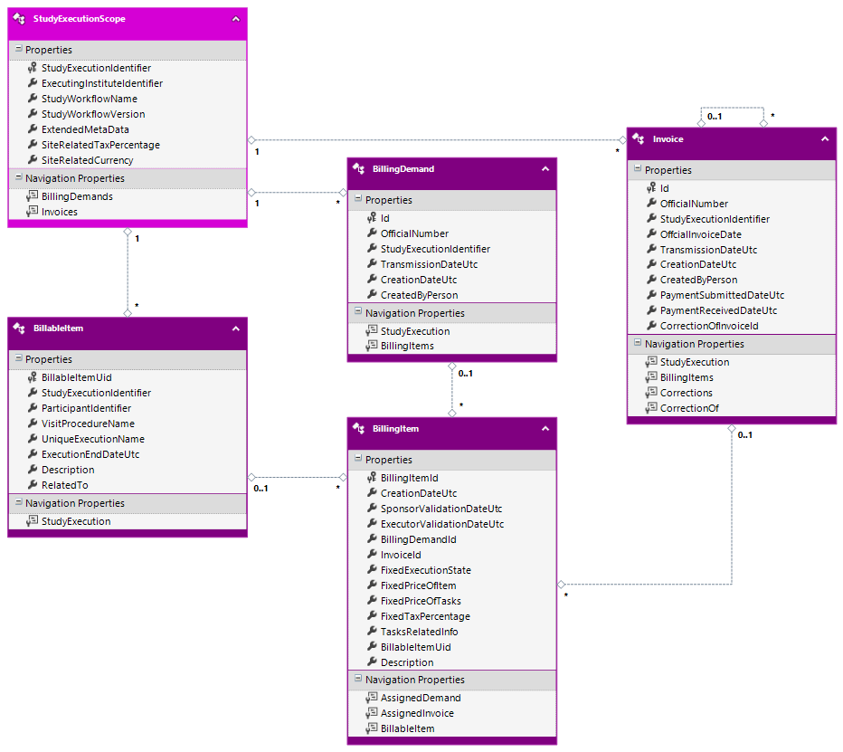

# ORSCF-BillingData Schema Specification

|          | Info                                    |
|----------|-----------------------------------------|
|author:   |[ORSCF](https://www.orscf.org) ("Open Research Study Communication Formats") / T.Korn|
|license:  |[Apache-2](https://choosealicense.com/licenses/apache-2.0/)|
|version:  |2.0.0|
|timestamp:|2024-11-03 00:00|

### Contents

  * .  [BillingItem](#BillingItem)
  * .  [StudyExecutionScope](#StudyExecutionScope)
  * ........\  [BillableItem](#BillableItem)
  * ........\  [BillingDemand](#BillingDemand)
  * ........\  [Invoice](#Invoice)

# Model:

## BillingItem

Respresents a Snapshot, containig al the values, which are required to be fixed in relation to a concrete invoice or demand
### Fields

| Name | Type | Required | Fix |
| ---- | ---- | -------- | --- |
| [BillingItemId](#BillingItemBillingItemId-Field) **(PK)** | *int64* | YES | no |
| CreationDateUtc | *datetime* | YES | no |
| [SponsorValidationDateUtc](#BillingItemSponsorValidationDateUtc-Field) | *datetime* | no | no |
| [ExecutorValidationDateUtc](#BillingItemExecutorValidationDateUtc-Field) | *datetime* | no | no |
| [BillingDemandId](#BillingItemBillingDemandId-Field) (FK) | *guid* | no | no |
| [InvoiceId](#BillingItemInvoiceId-Field) (FK) | *guid* | no | no |
| FixedExecutionState | *int32* | YES | no |
| [FixedPriceOfItem](#BillingItemFixedPriceOfItem-Field) | *decimal* | YES | no |
| [FixedPriceOfTasks](#BillingItemFixedPriceOfTasks-Field) | *decimal* | YES | no |
| FixedTaxPercentage | *decimal* | YES | no |
| TasksRelatedInfo | *string* | YES | no |
| [BillableItemUid](#BillingItemBillableItemUid-Field) (FK) | *guid* | no | no |
| Description | *string* | YES | no |
#### Unique Keys
* BillingItemId **(primary)**

#### BillingItem.**BillingItemId** (Field)
* this field represents the identity (PK) of the record
* this identity is a internal record id, so that it must not be exposed to other systems or displayed to end-users!

#### BillingItem.**SponsorValidationDateUtc** (Field)
* this field is optional, so that '*null*' values are supported

#### BillingItem.**ExecutorValidationDateUtc** (Field)
* this field is optional, so that '*null*' values are supported

#### BillingItem.**BillingDemandId** (Field)
* this field is optional, so that '*null*' values are supported
* this field is used as foreign key to address the related 'AssignedDemand'

#### BillingItem.**InvoiceId** (Field)
* this field is optional, so that '*null*' values are supported
* this field is used as foreign key to address the related 'AssignedInvoice'

#### BillingItem.**FixedPriceOfItem** (Field)

Including 'FixedPriceOfTasks' but excluding Taxes

#### BillingItem.**FixedPriceOfTasks** (Field)

An additional info which is only relevant when declaing Subtasks

#### BillingItem.**BillableItemUid** (Field)
* this field is optional, so that '*null*' values are supported
* this field is used as foreign key to address the related 'BillableItem'

### Relations

| Navigation-Name | Role | Target-Type | Target-Multiplicity |
| --------------- | -----| ----------- | ------------------- |
| [AssignedDemand](#AssignedDemand-lookup-from-this-BillingItem) | Lookup | [BillingDemand](#BillingDemand) | 1 (required) |
| [AssignedInvoice](#AssignedInvoice-lookup-from-this-BillingItem) | Lookup | [Invoice](#Invoice) | 1 (required) |
| [BillableItem](#BillableItem-lookup-from-this-BillingItem) | Lookup | [BillableItem](#BillableItem) | 1 (required) |

##### **AssignedDemand** (lookup from this BillingItem)
Target Type: [BillingDemand](#BillingDemand)
Addressed by: [BillingDemandId](#BillingItemBillingDemandId-Field).
##### **AssignedInvoice** (lookup from this BillingItem)
Target Type: [Invoice](#Invoice)
Addressed by: [InvoiceId](#BillingItemInvoiceId-Field).
##### **BillableItem** (lookup from this BillingItem)
Target Type: [BillableItem](#BillableItem)
Addressed by: [BillableItemUid](#BillingItemBillableItemUid-Field).

## StudyExecutionScope

### Fields

| Name | Type | Required | Fix |
| ---- | ---- | -------- | --- |
| [StudyExecutionIdentifier](#StudyExecutionScopeStudyExecutionIdentifier-Field) **(PK)** | *guid* | YES | YES |
| [ExecutingInstituteIdentifier](#StudyExecutionScopeExecutingInstituteIdentifier-Field) | *string* | YES | YES |
| [StudyWorkflowName](#StudyExecutionScopeStudyWorkflowName-Field) | *string* (100) | YES | YES |
| [StudyWorkflowVersion](#StudyExecutionScopeStudyWorkflowVersion-Field) | *string* (20) | YES | YES |
| [ExtendedMetaData](#StudyExecutionScopeExtendedMetaData-Field) | *string* | no | no |
| SiteRelatedTaxPercentage | *decimal* | YES | no |
| [SiteRelatedCurrency](#StudyExecutionScopeSiteRelatedCurrency-Field) | *string* | YES | no |
#### Unique Keys
* StudyExecutionIdentifier **(primary)**

#### StudyExecutionScope.**StudyExecutionIdentifier** (Field)

a global unique id of a concrete study execution (dedicated to a concrete institute) which is usually originated at the primary CRF or study management system ('SMS')

* this field represents the identity (PK) of the record
* after the record has been created, the value of this field must not be changed any more!

#### StudyExecutionScope.**ExecutingInstituteIdentifier** (Field)

the institute which is executing the study (this should be an invariant technical representation of the company name or a guid)

* after the record has been created, the value of this field must not be changed any more!

#### StudyExecutionScope.**StudyWorkflowName** (Field)

the official invariant name of the study as given by the sponsor

* the maximum length of the content within this field is 100 characters.
* after the record has been created, the value of this field must not be changed any more!

#### StudyExecutionScope.**StudyWorkflowVersion** (Field)

version of the workflow

* the maximum length of the content within this field is 20 characters.
* after the record has been created, the value of this field must not be changed any more!

#### StudyExecutionScope.**ExtendedMetaData** (Field)

optional structure (in JSON-format) containing additional metadata regarding this record, which can be used by 'StudyExecutionSystems' to extend the schema

* this field is optional, so that '*null*' values are supported

#### StudyExecutionScope.**SiteRelatedCurrency** (Field)

ISO 3-Letter Code (USD, EUR, ...)

### Relations

| Navigation-Name | Role | Target-Type | Target-Multiplicity |
| --------------- | -----| ----------- | ------------------- |
| [BillingDemands](#BillingDemands-childs-of-this-StudyExecutionScope) | Childs | [BillingDemand](#BillingDemand) | * (multiple) |
| [Invoices](#Invoices-childs-of-this-StudyExecutionScope) | Childs | [Invoice](#Invoice) | * (multiple) |

##### **BillingDemands** (childs of this StudyExecutionScope)
Target: [BillingDemand](#BillingDemand)
##### **Invoices** (childs of this StudyExecutionScope)
Target: [Invoice](#Invoice)

## BillableItem

### Fields

| Name | Type | Required | Fix |
| ---- | ---- | -------- | --- |
| [BillableItemUid](#BillableItemBillableItemUid-Field) **(PK)** | *guid* | YES | no |
| [StudyExecutionIdentifier](#BillableItemStudyExecutionIdentifier-Field) (FK) | *guid* | YES | no |
| [ParticipantIdentifier](#BillableItemParticipantIdentifier-Field) | *string* (50) | YES | no |
| [VisitProcedureName](#BillableItemVisitProcedureName-Field) | *string* | YES | no |
| [UniqueExecutionName](#BillableItemUniqueExecutionName-Field) | *string* | YES | no |
| [ExecutionEndDateUtc](#BillableItemExecutionEndDateUtc-Field) | *datetime* | no | no |
| [Description](#BillableItemDescription-Field) | *string* | no | no |
| [RelatedTo](#BillableItemRelatedTo-Field) | *string* | YES | no |
#### Unique Keys
* BillableItemUid **(primary)**

#### BillableItem.**BillableItemUid** (Field)

a global unique id of a concrete study-visit execution which is usually originated at the primary CRF or study management system ('SMS')

* this field represents the identity (PK) of the record

#### BillableItem.**StudyExecutionIdentifier** (Field)

a global unique id of a concrete study execution (dedicated to a concrete institute) which is usually originated at the primary CRF or study management system ('SMS')

* this field is used as foreign key to address the related 'StudyExecution'

#### BillableItem.**ParticipantIdentifier** (Field)

identity of the patient which can be a randomization or screening number (the exact semantic is defined per study)

* the maximum length of the content within this field is 50 characters.

#### BillableItem.**VisitProcedureName** (Field)

unique invariant name of the visit-procedure as defined in the 'StudyWorkflowDefinition' (originated from the sponsor)

#### BillableItem.**UniqueExecutionName** (Field)

title of the visit execution as defined in the 'StudyWorkflowDefinition' (originated from the sponsor)

#### BillableItem.**ExecutionEndDateUtc** (Field)
* this field is optional, so that '*null*' values are supported

#### BillableItem.**Description** (Field)
* this field is optional, so that '*null*' values are supported

#### BillableItem.**RelatedTo** (Field)

One of the following values: 'General' / 'Site' / 'Paticipant' (Requires a ParticipantIdentifier) / 'Visit' (Requires a ParticipantIdentifier and UniqueExecutionName)

### Relations

| Navigation-Name | Role | Target-Type | Target-Multiplicity |
| --------------- | -----| ----------- | ------------------- |
| [StudyExecution](#StudyExecution-parent-of-this-BillableItem) | Parent | [StudyExecutionScope](#StudyExecutionScope) | 0/1 (optional) |

##### **StudyExecution** (parent of this BillableItem)
Target Type: [StudyExecutionScope](#StudyExecutionScope)
Addressed by: [StudyExecutionIdentifier](#BillableItemStudyExecutionIdentifier-Field).

## BillingDemand

created by the sponsor
### Fields

| Name | Type | Required | Fix |
| ---- | ---- | -------- | --- |
| [Id](#BillingDemandId-Field) **(PK)** | *guid* | YES | no |
| OfficialNumber | *string* | YES | no |
| [StudyExecutionIdentifier](#BillingDemandStudyExecutionIdentifier-Field) (FK) | *guid* | YES | no |
| [TransmissionDateUtc](#BillingDemandTransmissionDateUtc-Field) | *datetime* | no | no |
| CreationDateUtc | *datetime* | YES | no |
| CreatedByPerson | *string* | YES | no |
#### Unique Keys
* Id **(primary)**

#### BillingDemand.**Id** (Field)
* this field represents the identity (PK) of the record

#### BillingDemand.**StudyExecutionIdentifier** (Field)
* this field is used as foreign key to address the related 'StudyExecution'

#### BillingDemand.**TransmissionDateUtc** (Field)
* this field is optional, so that '*null*' values are supported

### Relations

| Navigation-Name | Role | Target-Type | Target-Multiplicity |
| --------------- | -----| ----------- | ------------------- |
| [StudyExecution](#StudyExecution-parent-of-this-BillingDemand) | Parent | [StudyExecutionScope](#StudyExecutionScope) | 0/1 (optional) |
| [BillingItems](#BillingItems-refering-to-this-BillingDemand) | Referers | [BillingItem](#BillingItem) | * (multiple) |

##### **StudyExecution** (parent of this BillingDemand)
Target Type: [StudyExecutionScope](#StudyExecutionScope)
Addressed by: [StudyExecutionIdentifier](#BillingDemandStudyExecutionIdentifier-Field).
##### **BillingItems** (refering to this BillingDemand)
Target: [BillingItem](#BillingItem)

## Invoice

created by the executor-company
### Fields

| Name | Type | Required | Fix |
| ---- | ---- | -------- | --- |
| [Id](#InvoiceId-Field) **(PK)** | *guid* | YES | YES |
| [OfficialNumber](#InvoiceOfficialNumber-Field) | *string* | YES | YES |
| [StudyExecutionIdentifier](#InvoiceStudyExecutionIdentifier-Field) (FK) | *guid* | YES | YES |
| [OffcialInvoiceDate](#InvoiceOffcialInvoiceDate-Field) | *datetime* | YES | YES |
| [TransmissionDateUtc](#InvoiceTransmissionDateUtc-Field) | *datetime* | no | no |
| CreationDateUtc | *datetime* | YES | no |
| CreatedByPerson | *string* | YES | no |
| [PaymentSubmittedDateUtc](#InvoicePaymentSubmittedDateUtc-Field) | *datetime* | no | no |
| [PaymentReceivedDateUtc](#InvoicePaymentReceivedDateUtc-Field) | *datetime* | no | no |
| [CorrectionOfInvoiceId](#InvoiceCorrectionOfInvoiceId-Field) (FK) | *guid* | no | no |
#### Unique Keys
* Id **(primary)**

#### Invoice.**Id** (Field)
* this field represents the identity (PK) of the record
* after the record has been created, the value of this field must not be changed any more!

#### Invoice.**OfficialNumber** (Field)

the invoice number

* after the record has been created, the value of this field must not be changed any more!

#### Invoice.**StudyExecutionIdentifier** (Field)
* this field is used as foreign key to address the related 'StudyExecution'
* after the record has been created, the value of this field must not be changed any more!

#### Invoice.**OffcialInvoiceDate** (Field)
* after the record has been created, the value of this field must not be changed any more!

#### Invoice.**TransmissionDateUtc** (Field)
* this field is optional, so that '*null*' values are supported

#### Invoice.**PaymentSubmittedDateUtc** (Field)
* this field is optional, so that '*null*' values are supported

#### Invoice.**PaymentReceivedDateUtc** (Field)
* this field is optional, so that '*null*' values are supported

#### Invoice.**CorrectionOfInvoiceId** (Field)
* this field is optional, so that '*null*' values are supported
* this field is used as foreign key to address the related 'CorrectionOf'

### Relations

| Navigation-Name | Role | Target-Type | Target-Multiplicity |
| --------------- | -----| ----------- | ------------------- |
| [BillingItems](#BillingItems-refering-to-this-Invoice) | Referers | [BillingItem](#BillingItem) | * (multiple) |
| [StudyExecution](#StudyExecution-parent-of-this-Invoice) | Parent | [StudyExecutionScope](#StudyExecutionScope) | 0/1 (optional) |
| [Corrections](#Corrections-refering-to-this-Invoice) | Referers | [Invoice](#Invoice) | * (multiple) |
| [CorrectionOf](#CorrectionOf-lookup-from-this-Invoice) | Lookup | [Invoice](#Invoice) | 1 (required) |

##### **BillingItems** (refering to this Invoice)
Target: [BillingItem](#BillingItem)
##### **StudyExecution** (parent of this Invoice)
Target Type: [StudyExecutionScope](#StudyExecutionScope)
Addressed by: [StudyExecutionIdentifier](#InvoiceStudyExecutionIdentifier-Field).
##### **Corrections** (refering to this Invoice)
Target: [Invoice](#Invoice)
##### **CorrectionOf** (lookup from this Invoice)
Target Type: [Invoice](#Invoice)
Addressed by: [CorrectionOfInvoiceId](#InvoiceCorrectionOfInvoiceId-Field).

